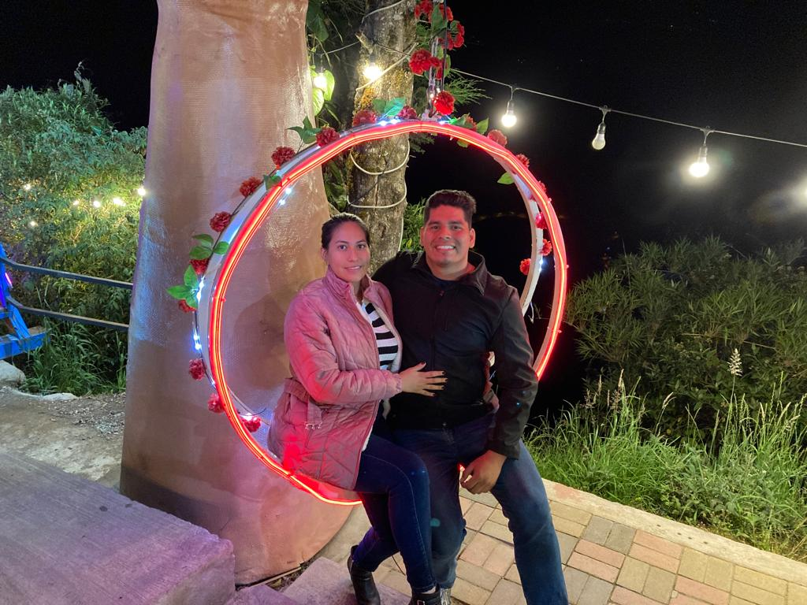

# Guillermo Terán, apasionado jugador de balonmano y estudiante de la ESPOL

Guillermo Terán es un estudiante de ingeniería en ciencias computacionales con diversos intereses y actividades. Entre sus hobbies favoritos se encuentran:
- Ver series
- Estudiar
- Entrenar y jugar al balonmano
Además de su vida académica, Guillermo también trabaja en una empresa llamada APS. Un aspecto destacado de su vida es que posee dos vehículos destinados al transporte escolar.

## Vida Académica

Con su dedicación al estudio de la ingeniería en ciencias computacionales, Guillermo demuestra su pasión por el mundo de la tecnología y la informática. Su amor por aprender se refleja tanto en su carrera académica como en su tiempo libre, donde disfruta de adquirir nuevos conocimientos y explorar diferentes campos de estudio.

## Vida Deportiva

El balonmano ocupa un lugar importante en la vida de Guillermo. Por un lado, dedica tiempo a entrenar y mejorar sus habilidades en este deporte. Por otro lado, también disfruta jugando activamente, lo que le permite mantenerse en forma y disfrutar de la competencia y el trabajo en equipo que caracterizan al balonmano.

## Vida Laboral

Además de su vida académica y sus hobbies, Guillermo también trabaja en una empresa llamada APS (Advance POS Solution), desenvolviendose en el cargo de Help Desk Tier 1. Este empleo le brinda experiencia laboral y la oportunidad de aplicar los conocimientos adquiridos en su carrera. Su trabajo en el campo de la informática puede estar relacionado con su formación como estudiante de ingeniería en ciencias computacionales.

En resumen, Guillermo Terán es un estudiante de ingeniería en ciencias computacionales con una pasión por la tecnología, aficionado a ver series, practicar y jugar al balonmano. Además, trabaja en APS y es responsable de dos vehículos de transporte escolar. Su vida está llena de diversas actividades que le permiten crecer en diferentes ámbitos y desarrollar una variedad de habilidades.

## Información de Contacto

- Facebook: [enlace facebook](https://www.facebook.com/GuillermoITM/)
- LinkedIn: [enlace linkedin](https://www.linkedin.com/in/gteran12/)
- Github: [enlace github](https://github.com/gTeran12)

